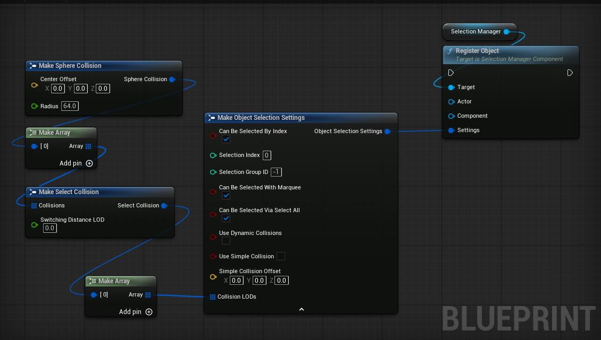
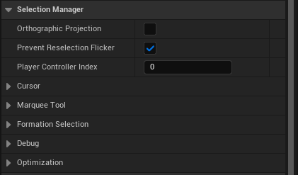
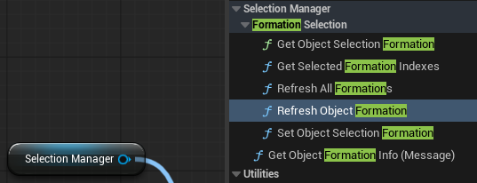
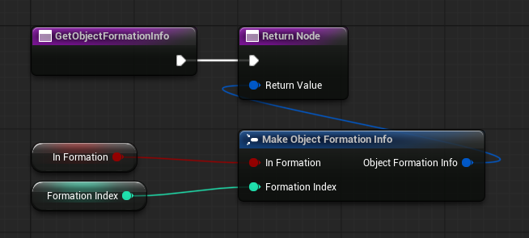
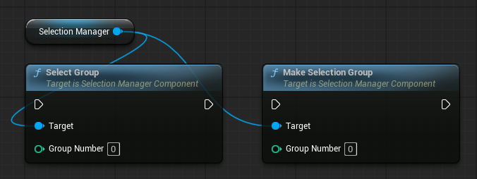
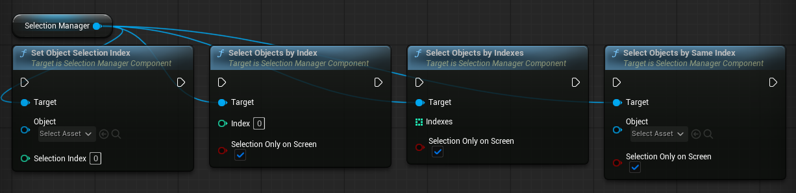
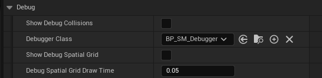
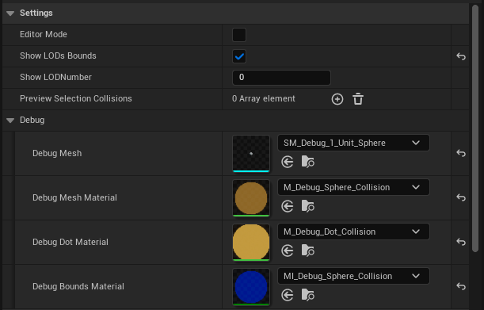

# Advanced Settings

!!! tip "Example level"
    You can see all Selection Manager features and usage examples in the example level,  
    located in the plugin's Content folder.

## Marquee Collision
If you do not provide custom settings when registering an object, **Simple Collision** will be used for selection box detection by default.

Simple Collision uses a single point at the center of the object. If this point is inside the selection box, the object will be selected. This is the most performant option, especially when you have many units.

You can create more complex selection collisions in the settings if you need more accurate selection. See the example level for a working setup.

For cursor selection, the plugin uses the object's own collision. Make sure the object's collision blocks the same trace channel that is set in the **Selection Manager** settings. By default, this is the `Visibility` channel.

| Mode | Setting | Use it for |
|---|---|---|
| **Simple** | `Use Simple Collision` (+ `Simple Collision Offset`) | A single point at the object center. Fastest — best for large unit counts. Used automatically when no LODs are set. |
| **Sphere LODs** | `Collision LODs` | One or more spheres (`Center Offset` + `Radius`) per LOD. LODs switch by camera distance (`Switching Distance LOD`). Precise selection for varied shapes. |
| **Dynamic** | `Use Dynamic Collisions` | Collision returned every frame by `Get Object Dynamic Collisions`. For collision tied to moving parts or bones. Slowest. |

!!! tip "Tuning collision visually"
    Assign **`BP_SM_Debugger`** to the manager's **Debugger Class** and enable **Show Debug Collisions** to see the spheres in play.
    The debugger also has an editor preview mode for authoring collision shapes and copy-pasting them into an object's `Collision LODs`.
   
!!! example "Collision Settings"
     For more details, see: [Collision Settings](collisions.md)

### Per-object options
Other fields in the `Register Object` **Settings**:

| Setting | Description |
|---|---|
| `Can Be Selected With Marquee` | Allow / disallow selection by the selection box. |
| `Can Be Selected Via Select All` | Include the object in `Select All`. |
| `Can Be Selected By Index` | Allow selection by `Select Objects By Index`. |
| `Selection Index` | The object's index for index-based selection. |
| `Selection Formation ID` | Group id for "select together" cohesion (see below). `-1` = ungrouped. |

 

## Selection Manager settings

### Cursor
| Setting | Description |
|---|---|
| `Trace Channel` | Collision channel used for cursor hits. |
| `Trace Complex` | Use per-poly mesh for cursor hits instead of simple collision. |
| `Highlight Object Under Cursor` | Auto-highlight the hovered object. |
| `Actor Hit Priority` | When both an actor and a component are hit, prefer the actor. |
| `Minimum Drag Distance` | Pixels the cursor must move before a click becomes a marquee drag. |
| `Disable Cursor Interaction` | Turn off cursor selection entirely (marquee only). |

### Marquee Tool
| Setting | Description |
|---|---|
| `Marquee Widget Class` | The selection-frame widget. Defaults to `WB_SM_MarqueeTool`; assign your own to restyle it. |
| `Enable Dynamic Object Highlighting` | Highlight objects inside the frame live while dragging. |
| `Snap Marquee Start Position` | Anchor the frame's start to the clicked world point, so you can keep selecting while the camera moves. |
| `Player Viewport Relative` | For player-attached widgets in split screen. |

!!! tip "**Widget**"
    You can swap the marquee widget during gameplay with `Set Marquee Widget Class`.
 

### General
| Setting | Description |
|---|---|
| `Orthographic Projection` | Enable when your camera is orthographic. |
| `Prevent Reselection Flicker` |  Keeps the current selection on screen until a new selection is finalized, so it doesn't blink empty for a frame when you start selecting again. |
| `Player Controller Index` | Which player controller to use. |

 

## Selection Typse

The plugin supports three independent object grouping systems:

- **Formation** — if one unit is selected or highlighted, all units with the same `Formation ID` are also selected or highlighted.
- **Selection Group** — RTS-style control groups. You can bind selected units or buildings to a hotkey using **Ctrl + 1...9**, and then select that group 
by pressing the number key.
- **By Index** — fast selection of units or buildings of the same type,  
for example when double-clicking a unit or building.

### Formation selection
When **`Select Entire Formation`** is enabled, hovering over or box-selecting any unit will highlight or select all units with the same `Formation ID`.

A `Formation ID` value of `-1` means that the unit is not part of any formation.   

Selection Manager functions for working with formations:   

| Name | Description |
|---|---|
| `Select Entire Formation` | Master toggle. When on, clicking / hovering / marqueeing any member selects the whole formation. |
| `Selection Formation ID` | The object's initial formation at registration. `-1` = ungrouped. |
| `Set Object Selection Formation` | Push a new formation at runtime (unit joins / leaves). `-1` to clear. |
| `Get Object Selection Formation` | Returns the object's current formation id, or `-1` if ungrouped or not registered. |
| `Get Object Formation Info` | The object reports whether it's in a formation and which one. Read at registration and on refresh — not every frame. |
| `Refresh Object Formation` | Re-pull one object's formation from its `Get Object Formation Info`. |
| `Refresh All Formations` | Re-pull formations for all registered objects at once. |
| `Get Selected Formation Indexes` | Returns the distinct formation IDs currently selected. |

`Finish Selection` also returns **`Selected Formation Indexes`** in its result (filled only when `Select Entire Formation` is enabled).

You also need to implement the `Get Object Formation Info` interface function by creating two variables.

You can use these variables for your own gameplay logic. If you change their values at runtime, call the appropriate `Refresh` function in the **Selection Manager** to apply the changes.   

  

### Selection Groups

You can create RTS-style control groups by pressing **Ctrl + Number** to assign the current selection to a group, and then pressing that number to select the group.   
You can also set up double-click selection, allowing the player to select all units or buildings of the same type.   

| Name | Description |
|---|---|
| `Make Selection Group` | Save the current selection under a number. |
| `Select Group` | Recall a previously saved group by its number. |

### Selection by Index

Select every object of the same kind at once — for example, double-click one unit to select all units of that type.  
When you register an object, set in its **Settings**:  

- `Selection Index` — a category ID, give the **same index** to everything you want selected together (infantry = `1`, cavalry = `2`).
- `Can Be Selected By Index` — keep enabled, objects with it off are skipped.

!!! tip 
    The index is assigned at registration. To change it later, use `Set Object Selection Index` function

Call one of these on the **Selection Manager**:  

| Function | Use |
|---|---|
| `Select Objects By Index` | Select all registered objects with that index. |
| `Select Objects By Same Index` | Select everything sharing the given object's index - pass the clicked unit (great for double-click). |
| `Select Objects By Indexes` | Select several categories at once. |

Each has a **`Selection Only On Screen`** parameter: when on, only objects currently visible on screen are selected.

!!! warning "Double-click selection by index"
    When `Prevent Reselection Flicker` is enabled in Selection Manager settings, a double-click must call `Interrupt Selection` before `Select Objects By Same Index`.

  

## Optimization
For large numbers of selectable objects:

| Setting | Description |
|---|---|
| `Throttle Marquee Highlight` + `Marquee Highlight Update Interval` | Update live marquee highlighting on an interval instead of every frame. |
| `Use Spatial Grid` *(experimental)* | Broad-phase grid for simple-collision marquee tests. Tune with `Cell Size`, `Selection Plane Z`, `Bounds Padding`, `Rebuild Interval`. |

## Debugging
The **Selection Manager Component** includes a debug mode that displays the collision data used for marquee selection.  
  

| Setting | Description |
|---|---|
| `Show Debug Collisions` + `Debugger Class` | Draw each object's selection collision / LODs in play. |
| `Show Debug Spatial Grid` + `Debug Spatial Grid Draw Time` | Draw occupied spatial-grid cells. |

### Debugger Class

Select `BP_SM_Debugger` as the debugger class. `BP_SM_Debugger` is included with the plugin.  
You can adjust the visual style of the displayed collision volumes in the `BP_SM_Debugger` settings.  

!!! warning "Modifying plugin assets"

    If you want to modify any plugin asset, make a copy of it and move the copy to your project folder.  
    Otherwise, your changes may be lost when the plugin is updated.

  