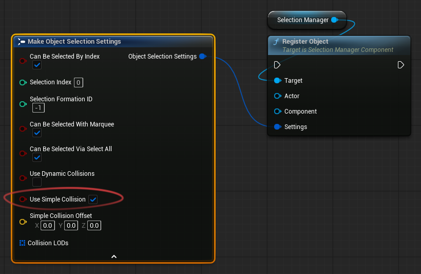
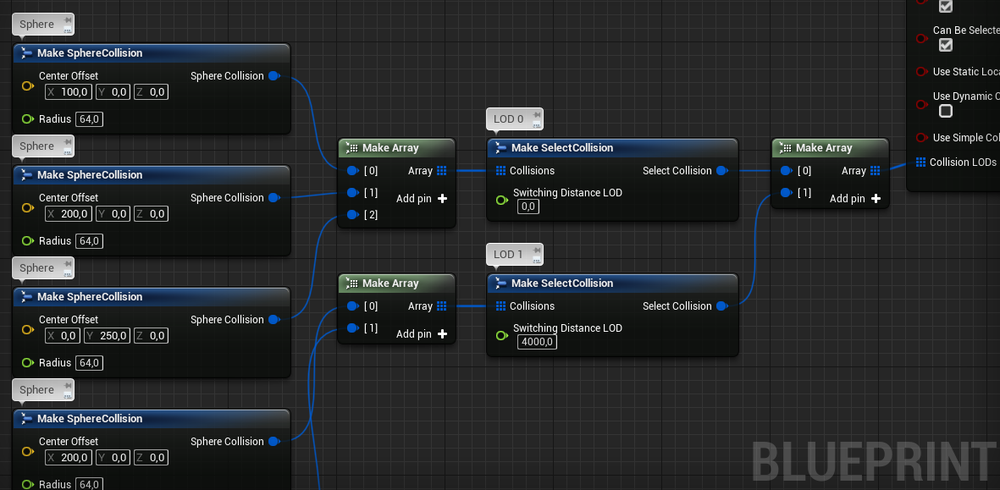
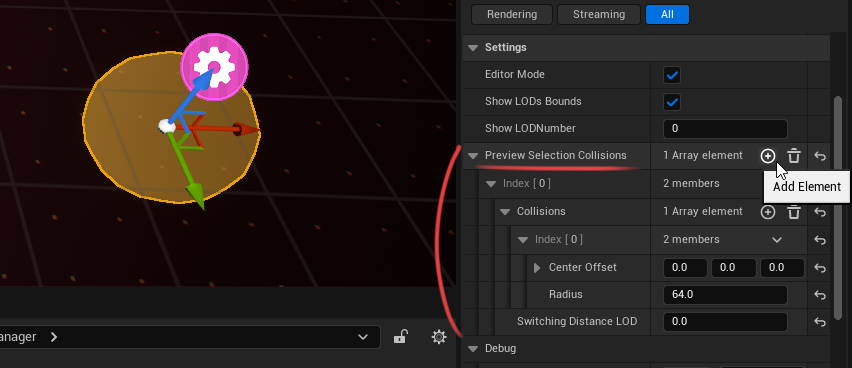
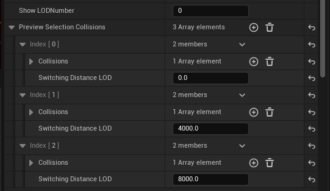
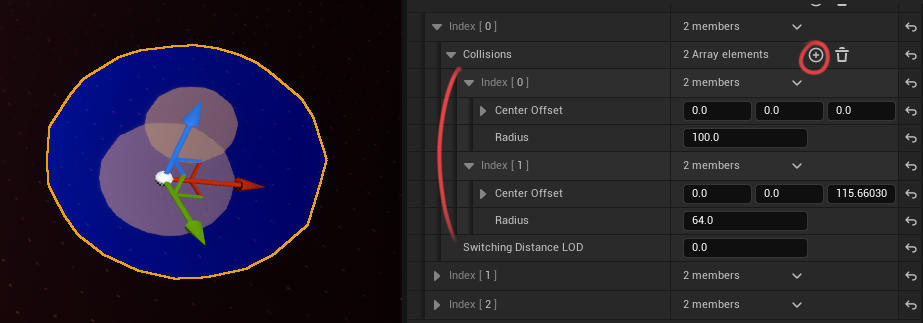
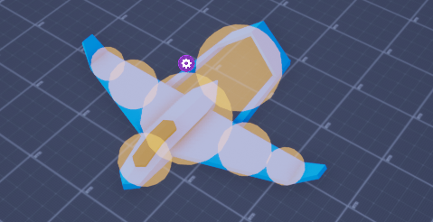
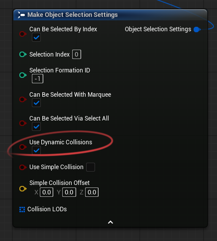
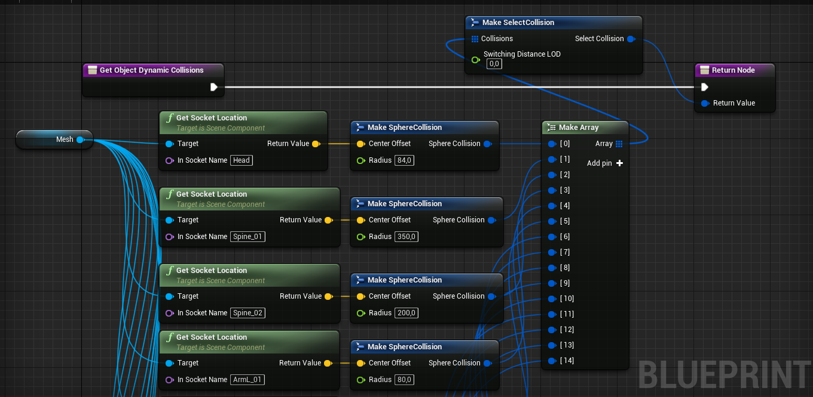
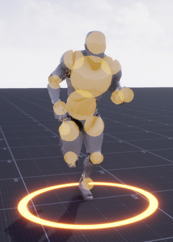

In **Selection Manager** plugin, **Selection Collision** is a lightweight, sphere-based shape used to test an object against the **Marquee selection box** — it is completely separate from the object's physics collision. 
The plugin uses simple math-based calculations without expensive traces.  
You can configure different selection collisions for different objects.  

> **Cursor selection** uses a normal line trace on the manager's `Trace Channel`, so it relies on the object's real collision/mesh.
> **Selection collisions described here are only for the marquee box.**

> If an object should not be selected with the selection box, for example a building,  
> disable **Can Be Selected With Marquee** in the object's registration settings.
> For buildings, you can use mouse selection only and rely on the object's regular physics or mesh collision.

## Choosing a Collision Type

Choose the collision type based on the required selection accuracy and the expected number of selectable objects.

### Simple Collision

Use **Simple Collision** when the camera is far away or when you have many units.

In this mode, the object is selected if its center point is inside the marquee selection box.   This is the fastest option and is usually enough for large groups of units.

### Complex Collision

Use **Complex Collision** when you need more accurate selection.

You can create one or more spheres that cover the unit's shape. This makes selection more precise than using only the center point.

This mode also supports **LODs**. For example, you can configure the object to use a single point when the camera is far away, and multiple spheres when the camera is close.

### Dynamic Collision

Use **Dynamic Collision** when you need the most accurate selection based on the object's actual shape, including animated parts.

Dynamic collisions can follow character bones, which makes them suitable for animated units. This is the most expensive option, so it is recommended only when you have a small number of units.

 

## Simple Collision Setup
To use **Simple Collision**, enable the **Simple Collision** option in the object registration settings: 

 

## Complex Collision Setup

To simplify collision setup, the plugin includes a Blueprint named `BP_SM_CollisionViewer`.   You can find it in the plugin's Content folder. This Blueprint helps you visually configure selection collision for an object.  
You can also create selection collisions manually in Blueprints:  

### 1. Place the Collision Viewer
Drag `BP_SM_CollisionViewer` into the scene.  
Also place the object you want to configure collision for in the scene.  
Align the object and the Collision Viewer.  
Their position, rotation, and scale should match.  

### 2. Create a collision LOD
Select the Collision Viewer and find the **Preview Selection Collisions** parameter in the Details panel. Add a new element.

This element represents a collision LOD. Each LOD is used at a specific camera distance from the object.
LODs are used for optimization: the farther an object is from the camera, the less detailed its selection collision needs to be.

!!! note "Orthographic camera"

    If you use an orthographic camera and the **Orthographic Projection** option is enabled in the Selection Manager settings, only the first LOD is used. You do not need to create additional LODs.

Example: in the screenshot below, three LODs have been created.

- `LOD 0` is active while the distance to the camera is less than `4000`.
- `LOD 1` is active while the distance to the camera is less than `8000`.
- `LOD 2` is active when the distance to the camera is greater than `8000`.

To preview another LOD in the editor, set the LOD index in the Collision Viewer settings.  

### 3. Add collision elements

Each LOD has a **Collisions** parameter.

This parameter allows you to add spherical selection collisions or point-based selection collisions.

Add one or more elements. Each element contains two parameters:

- **Center Offset** — defines how the collision is offset relative to the object's center.
- **Radius** — defines the size of the spherical collision. If set to `0`, a point collision is used instead, which is slightly more performant.

You can create multiple collision elements to cover the object more accurately.

### 4. Create a collision variable

When the collision setup is complete, open your object's Blueprint and create a new variable of type `Select Collision`.
Copy the **Preview Selection Collisions** parameter from `BP_SM_CollisionViewer`.
Paste it into the collision variable you created in your object's Blueprint.
<video controls preload="metadata" width="512">
  <source src="../assets/videos/sm_doc_vid_02_web.mp4" type="video/mp4">
</video>

Connect the collision variable to the corresponding input in the **Object Selection Settings** function during object registration.  
The collision setup is now complete.

Remove `BP_SM_CollisionViewer` from the scene.
It is only needed for setup and does not need to remain in the scene at runtime.

 

## Dynamic Collision Setup
Dynamic Collision is most useful when you need precise marquee selection for objects whose selection points can move relative to the object's center at runtime.
This collision type is only used for marquee selection. It is not used when selecting an object by clicking on it.
For example, you can use Dynamic Collision when you want selection collisions to follow the bones or sockets of an animated character.

!!! warning "Performance"
    Dynamic Collision is the most expensive selection collision type. Use it only when you need runtime-updated collision data, or when the number of selectable objects is relatively small.

To use this collision type, enable **Use Dynamic Collisions** when registering the object.  

You do not need to create or connect the **Collision LODs** parameter when using Dynamic Collision. Instead, the collision data is provided through the `Get Object Dynamic Collisions` interface function.  

In this example, the collision is attached to sockets on the character's skeleton, so it follows the character's animation.  

You can implement any custom logic you need inside this function. The collision elements themselves are configured in the same way as Complex Collision.   

Result:  

 

