# Selection Manager — Quick Start (UE 5.7+)

## Install & Enable
1. In the Epic Games Launcher, go to the **Library** tab, search for **Selection Manager**,  
click **Install to Engine**, and choose your engine version.
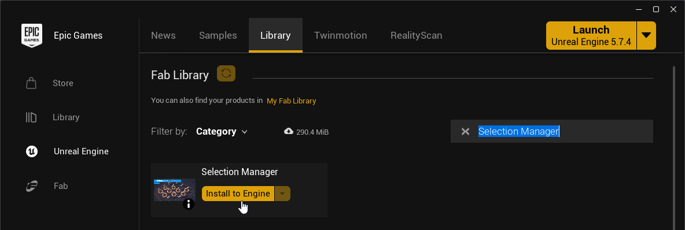

2. In the editor: **Edit → Plugins**, search **"Selection Manager"**, tick **Enabled**, and restart the editor.
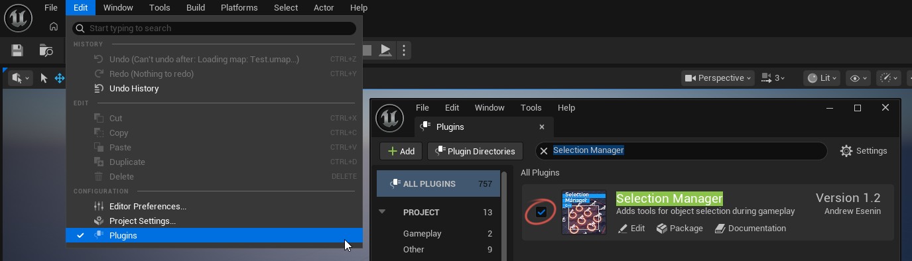

!!! example "**Example level**"
    The plugin's **Examples** folder includes a ready-made level with everything already wired up and working.  
    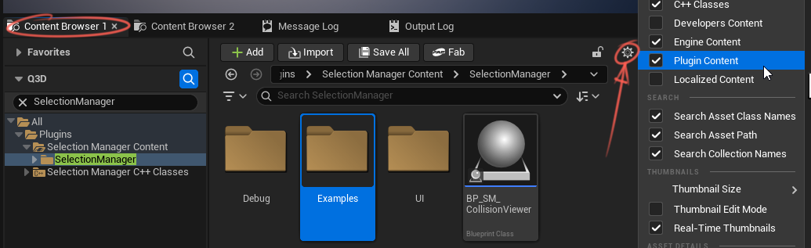
    If something does not work as expected, open the example level and compare it with your setup.
    Also, check the settings in the demo Blueprints. The Player Controller should have **Show Mouse Cursor**, **Enable Click Events**, and **Enable Mouse Over Events** enabled. Selectable objects should also have collision configured correctly.
 

## 1. Add the manager
Add a **Selection Manager Component** to your **Player Controller**.
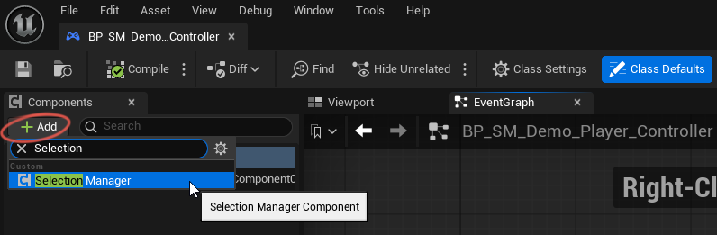
The Player Controller should have **Show Mouse Cursor**, **Enable Click Events**, and **Enable Mouse Over Events** enabled.
  

## 2. Hook up input
Set up your input bindings

!!! tip "Input system"
    I recommend using **Enhanced Input**  
    **Enhanced Input** is Unreal Engine's built-in modern input system  
    It is more flexible than the legacy input system and supports advanced input behavior  
    For more details, see: [Enhanced Input Documentation](https://dev.epicgames.com/documentation/unreal-engine/enhanced-input-in-unreal-engine)

!!! example "Demo Input"
    You can copy the demo input setup from `BP_SM_Demo_Player_Controller` as a quick solution for testing.

Bind the Selection Manager functions as follows:  
**Pressed → `Start Selection`**  
**Canceled → `Interrupt Selection`**  
**Released → `Finish Selection`**  
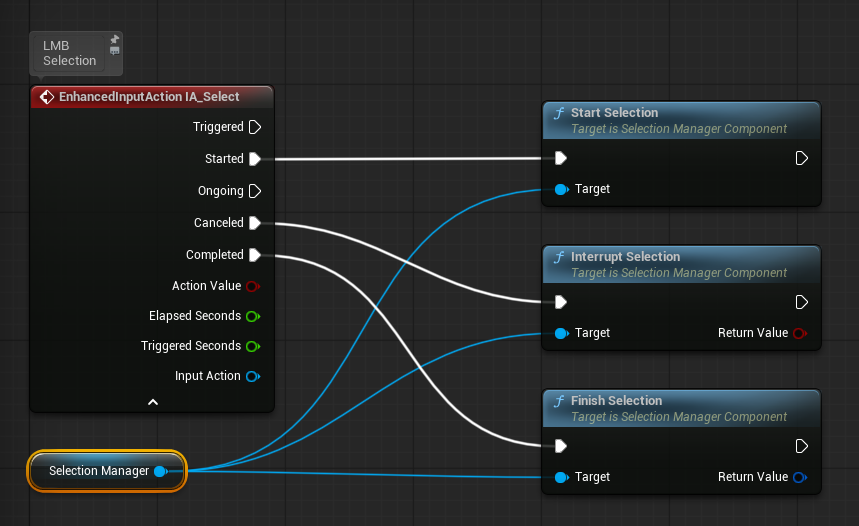 

Optional modifiers:  
`Set Addition Selection Enabled` (Shift) to add to the selection  
`Set Subtraction Selection Enabled` (Ctrl) to remove  
??? note "Screenshot"
    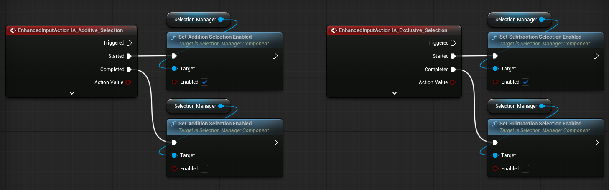 
 

## 3. Object Selection State
Add the **Selection Manager Interface** to the Blueprint class you want to make selectable:
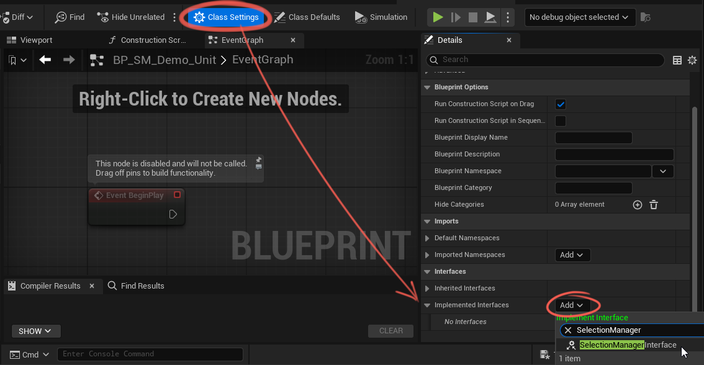 
!!! tip "Selectable actor types"
    You can use any class derived from `Actor` as a selectable object, including `Pawn` and `Character`  
    This is useful for selectable units, buildings, and other gameplay objects.  
    You can select objects of different classes at the same time. 
  

After adding the interface, the required functions will appear in the Blueprint.   
Double-click a function to implement it:  
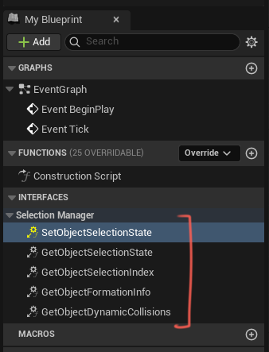 

| Function | Direction | Description |
|---|---|---|
| `Set Object Selection State` | Manager → Object | Called when the manager applies a new selection state to the object. Implement this function to update the object's visuals, such as selected or highlighted state. |
| `Get Object Selection State` | Object → Manager | Returns the object's current selection state, allowing the manager to read it and stay in sync. |
| `Get Object Selection Index` | Deprecated | Returns the object's selection index. Deprecated |
| `Get Object Formation Info` | Object → Manager | Returns whether the object belongs to a formation and which formation it belongs to. Used for group or formation co-selection. This value is read during registration and refresh. |
| `Get Object Dynamic Collisions` | Object → Manager | Returns the object's current marquee collision data each frame. This is only used when `Use Dynamic Collisions` is enabled, for example when collision depends on moving parts or bones. |

For the basic setup, you only need to implement  
`Set Object Selection State` and `Get Object Selection State`.  
> 💡 You can see how the remaining functions work in the included examples.  

Create a `Selection State` variable. It has four possible states:
<video controls preload="metadata" width="512">
  <source src="assets/videos/sm_doc_vid_01_web.mp4" type="video/mp4">
</video>

| State | Full Name | Description |
|---|---|---|
| `uSuH` | Un Selected and Un Highlighted | The default visual state. The object is not selected, and neither the cursor nor the selection box is hovering over it. |
| `uSH` | Un Selected and Highlighted | The object is not selected yet, but it is currently hovered by the cursor or covered by the selection box. This is typically used for hover preview or additive selection preview. |
| `SuH` | Selected and Un Highlighted | The object is still selected, but the highlight has been removed. This state is used during subtractive selection preview. |
| `SH` | Selected and Highlighted | The object is both selected and highlighted. This is the visual state for an already selected object. |

Next, configure your Actor's visuals for each selection state.  
The Examples folder includes the `BP_SM_Demo_Unit` Blueprint, which contains a complete selection visual setup for all states.

In the `Get Object Selection State` interface function, return the `Selection State` variable you created earlier.  
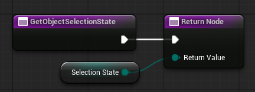 

  

## 4. Object Registration
To make an object selectable, register it in the **Selection Manager**.  
Only registered objects can participate in selection.

If you have a small number of objects, you can register each object from its own Blueprint.   
In this case, you need to get a reference to the **Selection Manager**.  
If you have many objects, or if they are controlled by a Player Controller or another manager,   
it is usually better to register them from that controller or manager.  
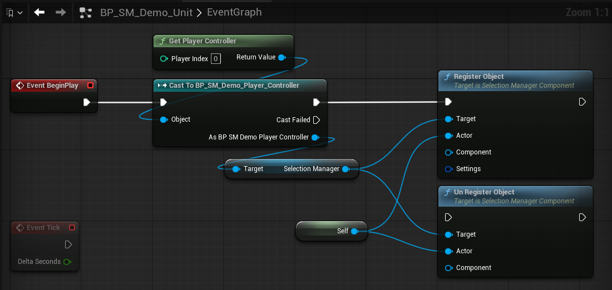
> 💡 You can call `Un Register Object` when the object is destroyed or when it should no longer be selectable.

  

## 5. Use the selection
Use `Get Selected Actors` to get all currently selected actors.  
Use `Get Selected Actors by Class` to get only selected actors of a specific class, for example only units or only buildings.  
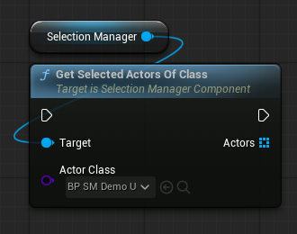

If you want to change an object's selection state manually, for example when clicking a unit icon, use one of the following functions:  
`Set Object Selection State` / `Set Object Selected` / `Set Object Highlighted` / `Toggle Object Selection`
??? note "Screenshot"
    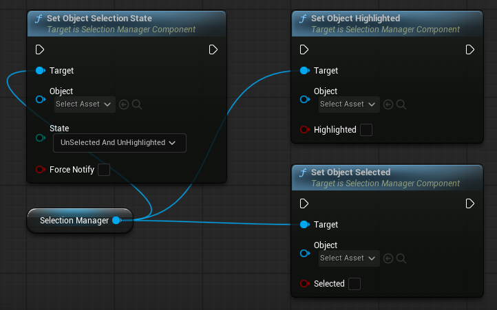