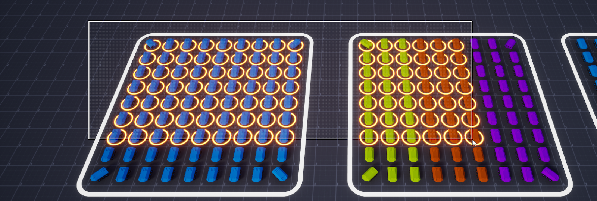

  
# Selection Manager (v1.3)
**Selection Manager** is a runtime object-selection toolkit for Unreal Engine — everything you need to let players select gameplay objects with the mouse, the way they do in RTS and strategy games. Click a unit, drag a selection box over a crowd, add to or subtract from the current selection, and group your units.  

It's **Blueprint-first** (no C++ required) and works with any `Actor`, `Pawn`, `Character`, or scene component — units, buildings, props, mixed together.  

Plugin on Fab: **[https://www.fab.com/listings/60701332-bc86-48ea-88ac-c13a145bf747](https://www.fab.com/listings/60701332-bc86-48ea-88ac-c13a145bf747)**  
Video: **[YouTube](https://www.youtube.com/watch?v=saT9hurKPGQ)**

!!! danger "**Examples**"
    **The demo level with examples is now included in the plugin's Content folder.**  
    **You can open it to see how everything is set up, or copy the ready-made Blueprints from it.**  
    **For more details, see: [Quick Start](index.md)**  

!!! example "**Old Demo Version**"
    **For UE 4.26-5.8+  **
    The old Demo still works. You can find additional content there, but some Selection Manager usage methods shown in it are now outdated.
    Before opening the demo project, download and enable the plugin.  
    [https://drive.google.com/file/d/15my5P1_cU3QbPhd2LQ4RwDoP8SwUqVjj/view?usp=share_link](https://drive.google.com/file/d/15my5P1_cU3QbPhd2LQ4RwDoP8SwUqVjj/view?usp=share_link)
    
 
!!! example "**Source Files**"
    All source files are also available in the plugin folder after installing it to the engine.  
    **`...\Epic Games\UE_5.x\Engine\Plugins\Marketplace\SelectionManager\Source`**

  