The selection frame is created by the `WB_SM_MarqueeTool` widget,  
which is included with the plugin.

`WB_SM_MarqueeTool` is made with Blueprints. You can modify it, choose one of the included presets, or create your own widget.

!!! warning "Modifying plugin assets"

    If you want to modify any plugin asset, make a copy of it and move the copy to your project folder.  
    Otherwise, your changes may be lost when the plugin is updated.

The plugin includes several material variants for customizing the visual style of the Marquee Tool.

You can configure them inside the `WB_SM_MarqueeTool` widget by replacing the materials in the **Brush** settings of the **UI Background** and **Frame** elements.  
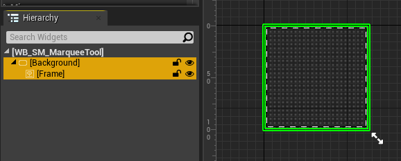

!!! tip
    You can also create and use your own widget for the selection frame.

 

## Frame

For the frame, you can use either a material or a texture inside the widget.  
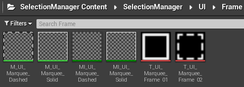

The **Brush** settings are different depending on whether you use a texture or a material:  
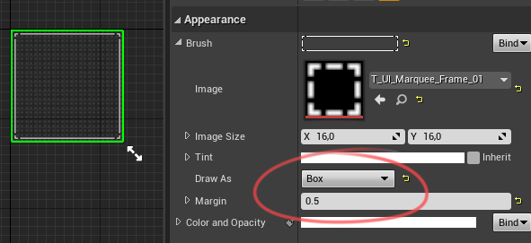
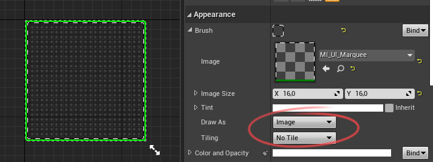

`MI_UI_Marquee_Solid` material creates a simple frame. You can adjust the thickness (Line Pixel Thickness), Color and Opacity of the material.  
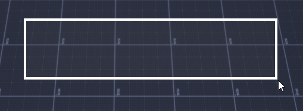

The `MI_UI_Marquee_Dashed` material creates a frame made of dashes, and you can adjust the thickness (Line Pixel Thickness), Animation Speed, size of dashes (Dashes Size), Color and Opacity of the material.  
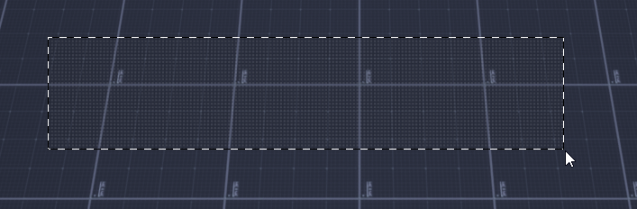

The use of `T_UI_Marquee_Frame_01` and `T_UI_Marquee_Frame_02` textures:  
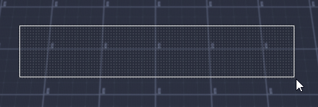
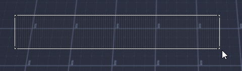

 

## Background

For the background, you can use either premade pattern variants or a solid color.  
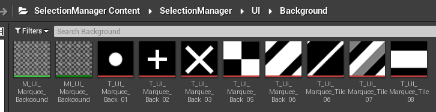

### Pattern Background

To use a pattern background, replace the texture in the `MI_UI_Marquee_Background` material.  
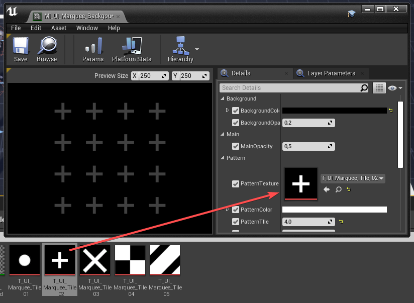

You can also adjust:

- **Background Color**
- **Pattern Color**
- **Tile Size**
- **Opacity**

You can also use a simple solid color.  
To do this, reset the material in the `WB_SM_MarqueeTool` settings.  
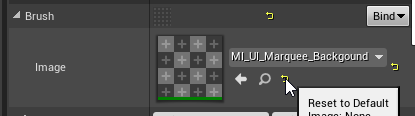  

  